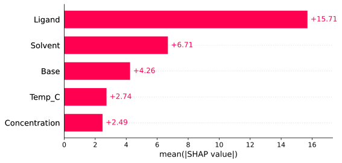
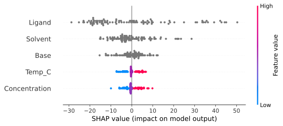

# Insights
In BayBE, insights provide a way of analyzing your experimental results beyond what is 
required for the basic measure-recommend loop. Dependencies needed for insights are 
optional and available by installing `baybe` with the respective dependency group, e.g. 
via `pip install baybe[insights]`.

```{admonition} Examples On This Page
:class: note
In what follows, we show results for the campaign studied in the 
[full lookup example](./../../examples/Backtesting/full_lookup), which aims at 
maximizing the yield of a chemical reaction and involves three substance parameters and  
two discrete numerical parameters. We randomly sample 100 measurements from the 
lookup table and add them to the campaign, providing a basis for creating an insight.
```

## Parameter Importance via SHAP
[**SH**apley **A**dditive ex**P**lanations](https://shap.readthedocs.io/en/latest/index.html) 
are a popular way of interpreting models to gain insight into the importance of the 
features utilized. In the context of Bayesian optimization (BO), this enables analyzing 
the importance of the parameters spanning the search space. This can be useful 
for identifying which parameters play a key role and which do not – learnings that can 
be applied in designing future campaigns. The interface is provided by the 
[`SHAPInsight`](baybe.insights.shap.SHAPInsight) class.

```{admonition} Model Interpretation in BO
:class: warning
While feature importance is a method well studied, it is usually applied in data 
regimes where models are fed with plenty of data. However, in BO, we often operate in 
the *low-to-no-data regime*, making feature importance interpretation potentially tricky. 
We urge the users to consider this and be careful with their interpretations. For 
instance, we suggest a study where the available amount of data is sub-sampled to check
the obtained parameter importances for convergence and consistency.
```

### Basic Usage
A [`SHAPInsight`](baybe.insights.shap.SHAPInsight) can be obtained in several ways:
- From a [`Campaign`](baybe.campaign.Campaign) via 
  [`from_campaign`](baybe.insights.shap.SHAPInsight.from_campaign):
  ~~~python
  insight = SHAPInsight.from_campaign(campaign)
  ~~~
- From a surrogate model via [`from_surrogate`](baybe.insights.shap.SHAPInsight.from_surrogate):
  ~~~python
  insight = SHAPInsight.from_surrogate(surrogate, data)
  ~~~
- From a recommender that has an underlying surrogate model and implements 
  [`get_surrogate`](baybe.recommenders.pure.bayesian.base.BayesianRecommender.get_surrogate) 
  via [`from_recommender`](baybe.insights.shap.SHAPInsight.from_recommender):
  ~~~python
  insight = SHAPInsight.from_recommender(recommender, searchspace, objective, data)
  ~~~

In these examples, `data` is the background data used to build the underlying explainer
model. Typically, you would set this to the measurements obtained during your 
experimental campaign (for instance, [`from_campaign`](baybe.insights.shap.SHAPInsight.from_campaign)
automatically extracts the `measurements` from the `campaign` object).

### Plots
After creating the insight, various methods are available to visualize the results via 
the [.plot](baybe.insights.shap.SHAPInsight.plot) 
interface, please refer to [available SHAP plots](baybe.insights.shap.SHAP_PLOTS).

~~~python
insight.plot("bar")
~~~


This result agrees well with the chemical intuition that ligands are the most important 
reactants to activate the conversion, resulting in higher yields.

Such plots can also be created for data sets other than the background data that
was used to generate the insight. If this is desired, pass your data frame as second 
argument:
~~~python
insight.plot("beeswarm", new_measurements)
~~~


The `force` plot type requires the user to additionally select which single data point 
they want to visualize by specifying the corresponding `explanation_index`:
~~~python
insight.plot(
    "force", explanation_index=3
)  # plots the force analysis of the measurement at positional index 3
~~~


### Explainers
In general, SHAP is an exhaustive method testing all combinations of features. This 
exhaustive algorithm (implemented by the {class}`shap.ExactExplainer` class) is
often not feasible in practice, and various approximate variants are available (see 
[supported explainers](baybe.insights.shap.EXPLAINERS)). For details about their inner 
mechanics, we refer to the [SHAP documentation](https://shap.readthedocs.io/en/latest/api.html#explainers).

The explainer can be changed when creating the insight:
~~~python
insight = SHAPInsight.from_campaign(
    campaign, explainer_cls="KernelExplainer"
)  # default explainer
~~~

### Experimental and Computational Representations
[`SHAPInsight`](baybe.insights.shap.SHAPInsight) by default analyzes the experimental
representation of the measurements, i.e. the that specifies parameter and target values
in terms of their actual (physical) quantities. This comes with certain limitations:

```{admonition} Experimental Representation Limits
:class: warning
If the experimental representation contains parameters with non-numeric values (such 
as [`CategoricalParameter`](baybe.parameters.categorical.CategoricalParameter), 
[`SubstanceParameter`](baybe.parameters.substance.SubstanceParameter) 
or [`CustomDiscreteParameter`](baybe.parameters.custom.CustomDiscreteParameter)), 
the only supported explainer is the [`KernelExplainer`](shap.KernelExplainer). 
Attempts to use other explainers will result in an 
[`IncompatibleExplainerError`](baybe.exceptions.IncompatibleExplainerError).
```

A feature importance study can still be performed by looking at the computational 
representation of the data points, activated by the `use_comp_rep` flag. Since all 
entries in this representation are numeric by construction, there are no limitations on
the explainer type used. A study of the computational representation might also be 
useful if a deeper analysis of descriptors used is of interest to the user. In general, 
for each non-numerical parameter in the experimental representation, there will be 
several descriptors the computational representation: 
~~~python
insight = SHAPInsight.from_campaign(campaign, use_comp_rep=True)
insight.plot("bar")
~~~


In addition to SHAP-based explainers, we also support 
[LIME](https://arxiv.org/abs/1602.04938) and 
[MAPLE](https://papers.nips.cc/paper_files/paper/2018/hash/b495ce63ede0f4efc9eec62cb947c162-Abstract.html) 
variants. For example:
~~~python
insight = SHAPInsight.from_campaign(
    campaign, explainer_cls="LimeTabular", use_comp_rep=True
)
insight.plot("bar")
~~~


As expected, the result from [`LimeTabular`](shap.explainers.other.LimeTabular) are very
similar to the results from the SHAP [`KernelExplainer`](shap.KernelExplainer) because
both methods involve linear local approximations.

### Multi-Output Surrogate Models
In case you are using a surrogate model with multiple outputs,
e.g. a [`CompositeSurrogate`](baybe.surrogates.composite.CompositeSurrogate) 
for a [`ParetoObjective`](baybe.objectives.pareto.ParetoObjective), 
there are multiple models to be analyzed. By default, for a
[`DesirabilityObjective`](baybe.objectives.desirability.DesirabilityObjective), you
will also be able to analyze the individual targets. However, if
[`DesirabilityObjective.as_pre_transformation=True`](baybe.objectives.desirability.DesirabilityObjective.as_pre_transformation),
then the SHAP analysis can only be performed based on the overall "Desirability". 

[`SHAPInsight`](baybe.insights.shap.SHAPInsight) calculates a separate explanation for
each model. When requesting a plot, you must select for which target the assessment
should be displayed:
~~~python
insight.plot("bar", target_index=2)  # plots the bar plot for the third target
~~~